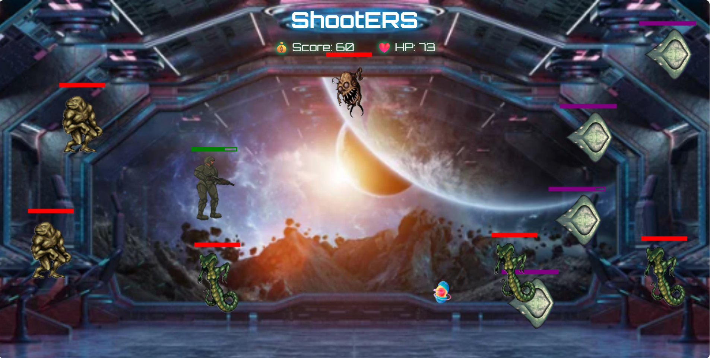
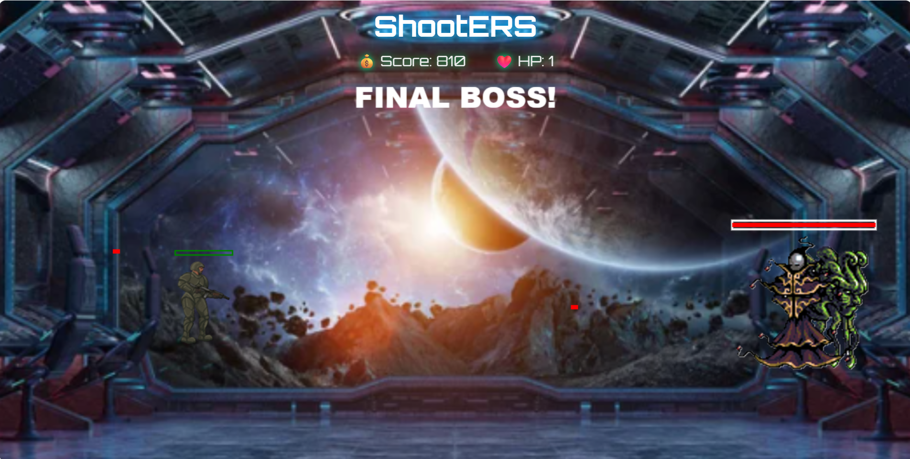

# Shooter Game

A 2D shooter game built with HTML5 Canvas. Control your hero, defeat waves of enemies, collect power-ups, and face a final boss!

---

## Table of Contents
- [Demo](#demo)
- [Features](#features)
- [Technologies Used](#technologies-used)
- [Gameplay Instructions](#gameplay-instructions)
- [Setup & Testing](#setup--testing)
- [Learning Outcomes](#learning-outcomes)
- [Credits](#credits)

---

## Demo





---

## Features
- **Player Movement:** Move with WASD keys
- **Shooting:** Click left mouse button
- **Enemies:** Multiple types, spawn from portals, unique movement
- **Boss Fight:** Challenging final boss with special attacks
- **Collectables:** 
    -  Health 
    -  Score 
    -  Speed 
    -  Berserk 
    -  Ignite 
    -  Slowdown
- **Health & Score System:** Track your progress and survival
- **Game Over & Victory Screens:** Clear feedback for win/loss
- **Responsive Canvas:** Adapts to window size
- **Asset Preloading:** Smooth experience with loading screen

---

## Technologies Used
- HTML5
- CSS3
- JavaScript (ES6+)
- Canvas API
- Jest (for unit testing)

---

## Gameplay Instructions
1. Open `index.html` in a modern browser.
2. Use **WASD** to move the player.
3. Click to shoot.
4. Avoid enemy contact; player health decreases on collision.
5. Defeat enemies and portals to earn points.
6. Collect power-ups for bonuses.
7. Defeat the boss to win!
8. Click **Restart** to play again.

---

## Setup & Testing

1. **Clone the repository:**
   ```bash
   git clone <your-repo-url>
   cd Shooter-Game
   ```
2. **Install dependencies:**
   ```bash
   npm install
   ```
3. **Run the game:**
   - Open `docs/index.html` in your browser.
4. **Run tests:**
   ```bash
   npm test
   ```
   All core game logic is covered by Jest unit tests in `docs/game.test.js`.

---

## Learning Outcomes
- Mastery of Canvas API for 2D games
- Game architecture: classes, state, and event handling
- Asset management and responsive design
- Writing and running unit tests for JavaScript

---


Enjoy the gameplay :)


